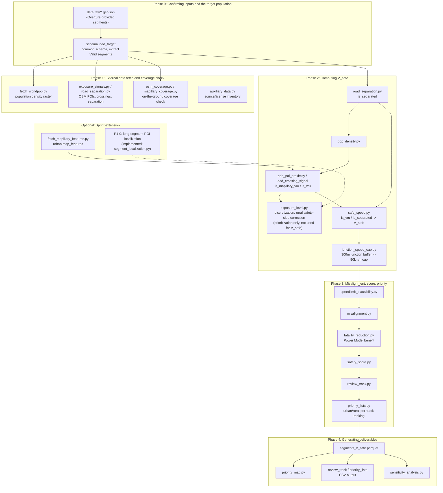
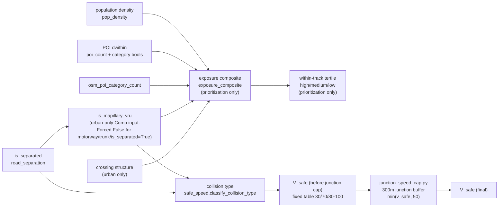
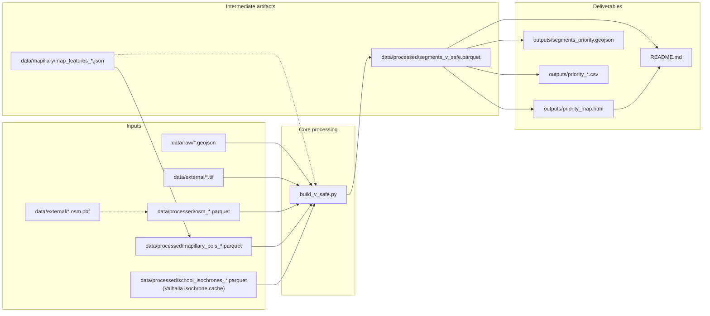

# Project Pipeline - ADB AI for Safer Roads Safer Speeds Challenge

This document organizes, building on the [project README](README.md) and the organizers' challenge brief, `src/`, and `notebooks/`, **the question this project must answer** and **the order in which processing should happen**, into a single flow.

---

## 1. The question the competition asks, and the deliverables

### The question (as defined by the organizers)

> Does the current **posted speed limit** align with Safe System principles?
> **This is not about "whether drivers are speeding."**

### The three deliverables (GitHub link)

| Deliverable | How this project addresses it |
|---|---|
| **Analytical model** | Code in `src/`, methodology and evaluation in [`README.md`](README.md) and this document, reproducible via [`notebooks/PIPELINE.ipynb`](notebooks/PIPELINE.ipynb) |
| **Speed Safety Score** | Per-segment `safety_score`, `priority_class`, and `review_track` in [`data/processed/segments_v_safe.parquet`](data/processed/segments_v_safe.parquet); CSV exports in `outputs/`; explainer in [`docs/speed_safety_score.md`](docs/speed_safety_score.md) |
| **Geospatial visualization** | Hosted interactive map at https://iiokentaro.github.io/adb-ai-for-safer-roads-safer-speeds-challenge/ ([`docs/index.html`](docs/index.html)) |

---

## 2. Design principles (constraints that run through the whole pipeline)

These are the premises behind "the order processing should happen in," and must not be broken downstream.

1. **The deliverable's protagonist is misalignment**
 `misalignment = SpeedLimit − V_safe`. V_safe is the internal yardstick.
2. **V_safe never takes SpeedLimit or observed speed as an argument** (structurally guaranteed in `src/safe_speed.py`).
3. **Observed speed (Median / F85) is diagnostic-only** (`operating_gap`, plausibility judgment). Never folded into the score's primary axis.
4. **SpeedLimit is used but never treated as ground truth.** Plausibility sorts it into "Review Needed / Field Verification Needed."
5. **VRU exposure runs on separate tracks for urban / rural.** Rural: "absence of data ≠ absence of exposure" → safety-side correction.
6. **Uncertainty is handled safety-side.** Confidence never mechanically excludes a segment from Top Priority (fine-tuning only).

---

## 3. Overall flow (the order processing should happen in)



---

## 4. Phase-by-phase detail

### Phase 0 - Confirming inputs and the analysis population

**Goal:** align Thailand and Maharashtra's road segments to a common format, and restrict the population to segments where speed data is usable.

| Item | Content |
|---|---|
| **Authoritative data source** | GeoJSON (full LineString geometry). CSV is attributes-only. |
| **Module** | `src/schema.py` |
| **Notebook** | `PIPELINE.ipynb` (Phase 0 section) / `geometry.py` |
| **Output** | **15,121 segments** targeted (after filtering by `AnalysisStatus=='Valid'`, etc.) |
| **Excluded** | Segments where speed is entirely 0 -> `data_quality_flag='invalid_speed'` (quarantined from the misalignment score) |

**Auxiliary:** `src/geometry.py` - assigns representative points and UTM zones (a prerequisite for distance computation and spatial joins).

---

### Phase 1 - Verifying external data and coverage

**Goal:** finalize the auxiliary data usable as input to V_safe (VRU exposure, separation structure), and record "how far it can be trusted."

| Module | What it does |
|---|---|
| `safe_system_inputs.py` | Inventory of Safe System arguments (speed not yet decided) |
| `osm_coverage.py`, `mapillary_coverage.py` | **On-the-ground coverage** check of OSM pedestrian tags / Mapillary imagery |
| `auxiliary_data.py` | URL / license inventory for WorldPop / OSM / Mapillary |

**External data acquisition (for a full reproduction run):**

| Data | Module | Saved to |
|---|---|---|
| Population density | `fetch_worldpop.py` | `data/external/*.tif` |
| OSM POIs, crossings, pedestrian ways | `exposure_signals.py` | `data/processed/osm_*.parquet` |
| Mapillary POI points | `exposure_signals.load_mapillary_pois` | `data/mapillary/map_features_*.json` -> `data/processed/mapillary_pois_*.parquet` |
| Road separation | `road_separation.py` | segment attribute `is_separated` |
| OSM junction nodes (`highway=traffic_signals` / `junction=yes`) | Overpass Turbo export (not pyrosm/pbf extraction) | `data/external/osm_junctions_*.geojson` -> `data/processed/osm_junctions_*.parquet` (`junction_speed_cap.py`) |

**Conclusion of the coverage check (pipeline branch point):**

- Urban: OSM crossing structure + Mapillary are usable -> exposure track A
- Rural: OSM/Mapillary coverage is thin -> population + POIs as the primary axis + **safety-side correction**

---

### Phase 2 - V_safe and VRU exposure

**Goal:** without using SpeedLimit or observed speed, determine per segment "the speed at which someone can be hit on this road and survive."

★ **`exposure_level` (the exposure-composite tertile) does not determine V_safe.** It is a signal used **only for prioritizing** intervention sites, via the Speed Safety Score's exposure axis (weight 35%, Phase 3) and the ranking in `priority_lists.py`. The collision type (-> V_safe) is determined directly from `is_vru` (a concrete VRU structure detected by Mapillary, **or** an OSM `amenity=school` node) and `is_separated` (physical separation). Schools also remain on the exposure side (`osm_poi_category_count`), so they affect both axes (double counting is allowed, the same policy as for Mapillary VRU). **The school VRU zone's geometry defaults to the Valhalla pedestrian isochrone** (when `school_isochrones_{country}.parquet` exists). If the parquet doesn't exist, it falls back to a dwithin circular buffer. ★



| Step | Module | Key points |
|---|---|---|
| Separation determination | `road_separation.py` | OSM oneway/motorway, etc. Run before POI processing (used as a mask for `is_vru`/`is_mapillary_vru`) |
| Population density | `pop_density.py` | Samples the WorldPop raster at the representative point |
| POI proximity | `exposure_signals.add_poi_proximity` | OSM + Mapillary points, after UTM projection, joined via `sjoin(dwithin)` (urban 200m / rural 400m). No per-segment buffer polygon is generated. Computes `is_mapillary_vru` (Mapillary-only) and `is_vru = is_mapillary_vru OR OSM school`. **The school VRU zone's geometry defaults to the Valhalla pedestrian isochrone (urban 3 min / rural 5 min)** (see "School VRU zone definition" below for details) |
| Crossings | `exposure_signals.add_crossing_signal` | OSM crossing points (urban only, 25m, as before) |
| Exposure discretization (prioritization only) | `exposure_level.py` | Urban: `pop_density` + `poi_count` + `osm_poi_category_count` + `is_mapillary_vru` + `crossing_count`. Rural: population + POI signals only |
| Rural correction | `exposure_level.apply_rural_safety_margin` | High population, no crossing detected -> exposure raised, confidence=low |
| Collision type -> V_safe | `safe_speed.py` | `is_vru` -> pedestrian(30); `is_separated` -> separated(80-100)/head_on(70). Motorway physical exception (lifted if F85 is low) |
| Junction speed cap | `junction_speed_cap.py` | Within a 300m buffer of `highway=traffic_signals`/`junction=yes`, V_safe is capped to <=50 (applied even to physically separated segments (`is_separated`); however, `road_class=='motorway'` and `is_grade_separated` segments (`road_separation.py`, matched against OSM ways with bridge/tunnel/layer!=0) are excluded, since a nearby junction there is a grade separation, not an at-grade conflict) |

**Orchestration:** `src/build_v_safe.py` (Phase 2 portion)
**Interactive reproduction:** `notebooks/PIPELINE.ipynb` (Phase 2 section)

**Intermediate artifact:** `data/processed/segments_v_safe.parquet` (the complete table through V_safe)

**POI-proximity output columns (segment attributes):**

| Column | Meaning |
|---|---|
| `is_school`, `is_hospital`, `is_marketplace`, `is_shop`, `is_bus_stop` | Category bools, OR-aggregated across OSM / Mapillary sources |
| `is_pedestrian`, `is_bicycle` | From Mapillary map_features |
| `poi_count` | Total dwithin hit count (OSM + Mapillary) |
| `osm_poi_category_count` | Sum of OSM category bools (0-5) |
| `is_mapillary_vru` | OR (0/1) of Mapillary VRU structures (school-zone signage / crosswalk markings / bicycle markings). Forced `False` for motorway, trunk, and `is_separated==True`. Input to the **urban exposure composite** (Mapillary-only sub-signal) |
| `is_vru` | The source-agnostic VRU trigger that drives V_safe. `is_mapillary_vru OR (OSM amenity=school)` (0/1). Same mask (forced False for motorway/trunk/`is_separated==True`). The sole basis for the `pedestrian` (30km/h) classification. Schools also remain on the exposure side (`osm_poi_category_count`), so double counting is allowed |
| `near_junction` / `v_safe_basis=='side_impact:junction_buffer'` | Whether the segment falls within a junction buffer (`junction_speed_cap.py`), and whether the cap actually took effect |

#### School VRU zone definition (isochrone vs. circular buffer)

| Item | Content |
|---|---|
| **Default (isochrone)** | References `data/processed/school_isochrones_{country}.parquet`: the reachable area on the Valhalla pedestrian network (urban 3 min / rural 5 min). Generated via `python src/school_isochrone.py --country thailand`. See `valhalla/README.md` for setting up the Valhalla environment. |
| **Fallback (circular buffer)** | Used when the parquet doesn't exist, or when `add_poi_proximity(target, use_isochrone=False)` is specified. dwithin urban 200m / rural 400m. |
| **Rural safety-side handling** | isochrone union 200m circular floor (prevents the isochrone from underestimating in areas where the OSM pedestrian network is sparse) |
| **The exposure axis is unchanged** | The isochrone only changes the geometry behind the `is_school`/`is_vru` determination. `osm_poi_category_count` (the exposure axis) still reflects the dwithin result, unchanged |
| **Sensitivity analysis** | The overlap of priority segments (recall/Jaccard) against the circular-buffer version is planned as axis (4) of `sensitivity_analysis.py` |

To explicitly use the circular buffer:

```python
from exposure_signals import add_poi_proximity
target = add_poi_proximity(target, use_isochrone=False) # urban 200m / rural 400m circular buffer
```

**Performance:** the old implementation (segment LineString -> buffer polygon -> within) took ~55 minutes for all of Thailand. After replacing it with `dwithin`, it takes ~3 seconds (assuming 15,121 segments and cached POIs).

---

### Phase 3 - Misalignment, Speed Safety Score, and priority list

**Goal:** score "segments where the posted speed limit is too high" and turn it into a list and map the ministry of transport can use.

| Order | Module | Output columns / files |
|---|---|---|
| 1. Plausibility | `speedlimit_plausibility.py` | `speedlimit_plausibility` (high/low) |
| 2. Misalignment | `misalignment.py` | `misalignment`, `misalignment_magnitude`, `operating_gap` |
| 3. Fatality-reduction estimate | `fatality_reduction.py` | `delta_fatal_percent`, `delta_fatal_abs`, `power_environment_used` |
| 4. Speed Safety Score | `safety_score.py` | `safety_score`, `priority_class`, `score_explanation` |
| 5. Triage | `review_track.py` | `review_track` (Review Needed / Field Verification Needed) |
| 6. Per-track ranking | `priority_lists.py` | `rank_within_environment`, `priority_urban.csv`, `priority_rural.csv` |

**Speed Safety Score (3 axes):**

```
safety_score = 100 x (0.50 x misalignment + 0.35 x exposure + 0.15 x confidence)
```

- Misalignment: `SpeedLimit − V_safe` (primary axis)
- Exposure: VRU exposure level
- Confidence: a composite of exposure, separation, and SpeedLimit-record confidence
- **Priority-class percentiles are computed separately for each of the 4 (country, land_use) cells** (Thailand/Maharashtra and urban/rural populations are never pooled. `exposure_level.py`'s tertile split and `priority_lists.py`'s within-track ranking are likewise split 4 ways by (country, land_use) or (country, environment), consistently never mixing populations across country/land_use at any stage)

**Orchestration:** `src/build_v_safe.py` (Phase 2-3 combined)
**Interactive reproduction:** `notebooks/PIPELINE.ipynb` (Phase 3 section)

---

### Phase 4 - Generating and verifying the deliverables

**Goal:** a two-track approach - a path where a reviewer can confirm results from just a clone, and a path to verify the computation process itself.

#### Fast path (recommended for reviewers)

```bash
python src/quick_reproduce.py
```

| Input | Processing | Output |
|---|---|---|
| Only `data/processed/segments_v_safe.parquet` | Map, CSV, sensitivity analysis | See table below |

| Output file | Content |
|---|---|
| `outputs/priority_map.html` | Interactive priority-segment map |
| `outputs/priority_map_static.png` | Static summary |

> **Map display spec (`priority_map.py`, updated 2026-07-01):** a display-only category `map_class` is derived, splitting "No Issue" into **Aligned** (`misalignment<=0`, posted limit at or below V_safe = no room to lower it, saturated green `#00a651`) and **Low Priority** (`misalignment>0`, yellow-green `#a6d96a`) (the underlying `priority_class` data column is unchanged). The five primary categories (Top Priority/Priority/Watch/Low Priority/Aligned) are shown **on by default** (Aligned/Low Priority are rendered lightly, without popups). It also overlays, as a point layer clustered via `FastMarkerCluster`, the features that localized V_safe (Mapillary VRU detections, OSM school nodes, junction nodes). The GeoJSON/GPKG exports contain only full-resolution segment data - the points, `map_class`, and coordinate rounding are for map rendering only.
| `outputs/segments_priority.geojson` / `.gpkg` | ESRI-compatible spatial output |
| `outputs/priority_review_needed.csv` | Review Needed list |
| `outputs/priority_field_check.csv` | Field Verification Needed list |
| `outputs/priority_urban.csv` / `priority_rural.csv` | Per-track priority lists |

**Modules:** `quick_reproduce.py`, `priority_map.py`, `review_track.py`, `priority_lists.py`, `sensitivity_analysis.py`

#### Full reproduction path (for verifying the computation)

```bash
# 1. Place the GeoJSON under data/raw/ (can be copied from QGIS/)
# 2. Fetch WorldPop
python -c "from fetch_worldpop import fetch_thailand, fetch_maharashtra; fetch_thailand; fetch_maharashtra"
# 3. Full pipeline
python src/build_v_safe.py
```

---

### Phase 5 (optional) - Sprint extension

Processing positioned, per FINAL_SPRINT_PLAN, as happening **after** the core pipeline or as an **addition on top of exposure**.

| Item | Module | Notebook | Status |
|---|---|---|---|
| Mapillary map_features fetch | `fetch_mapillary_features.py` | `fetch_mapillary_features.ipynb` | Implemented |
| Mapillary exposure integration | `exposure_signals.add_poi_proximity` | - | Implemented (category mapping in `poi_categories.py`) |
| Sensitivity analysis | `sensitivity_analysis.py` | `sensitivity_analysis.ipynb` | Implemented |
| Long-segment POI localization | `src/segment_localization.py` | `PIPELINE.ipynb` | P1-0 implemented (two-stage, influence-zone clipping) |

**Mapillary fetch flow (reference):**

```
StreetImageLink (bbox)
 -> split_bbox (split if over 0.01 deg²)
 -> GET /map_features (27 VRU-related categories)
 -> merge JSON per OBJECTID
 -> data/mapillary/map_features_{country}.json
 -> exposure_signals flattens -> mapillary_pois_{country}.parquet
 -> dwithin-joined via add_poi_proximity
```

---

## 5. `src/` module inventory (processing order)

| Order | File | Role |
|---|---|---|
| - | `schema.py` | GeoJSON loading, common schema, target extraction |
| - | `geometry.py` | Representative points, UTM |
| - | `explore_raw.py` | Raw-data exploration (development use) |
| 1 | `fetch_worldpop.py` | WorldPop download |
| 1 | `exposure_signals.py` | OSM POI / crossing extraction, dwithin proximity join |
| - | `poi_categories.py` | Mapillary object_value -> category bool mapping |
| 1.5 | `school_isochrone.py` | Generates and caches the school VRU zone's Valhalla pedestrian isochrone (a prerequisite for `add_poi_proximity`; uses the committed parquet when Valhalla isn't needed) |
| 1 | `road_separation.py` | Separation-structure determination |
| 1 | `osm_coverage.py` | OSM coverage check |
| 1 | `mapillary_coverage.py` | Mapillary coverage check |
| 1 | `safe_system_inputs.py` | Safe System input inventory |
| 1 | `auxiliary_data.py` | Auxiliary data sources |
| 2 | `pop_density.py` | Population density |
| 2 | `exposure_level.py` | Exposure discretization, rural correction (prioritization only, not used for V_safe) |
| 2 | `safe_speed.py` | Collision type, V_safe (determined directly from `is_vru`/`is_separated`) |
| 2 | `junction_speed_cap.py` | 50km/h V_safe cap via 300m junction buffer (`data/external/osm_junctions_*.geojson`, a given Overpass Turbo export) |
| 3 | `speedlimit_plausibility.py` | SpeedLimit confidence |
| 3 | `misalignment.py` | Misalignment, operating_gap |
| 3 | `fatality_reduction.py` | Power Model fatality-reduction estimate |
| 3 | `safety_score.py` | Speed Safety Score |
| 3 | `review_track.py` | Review Needed / Field Verification Needed triage |
| 3 | `priority_lists.py` | Urban/rural per-track lists |
| 4 | `build_v_safe.py` | **Full pipeline orchestration** |
| 4 | `quick_reproduce.py` | **Fast deliverable regeneration** |
| 4 | `priority_map.py` | Map, GeoJSON/GPKG |
| 4 | `sensitivity_analysis.py` | Sensitivity analysis |
| 5 | `fetch_mapillary_features.py` | Bulk Mapillary fetch |
| - | `plot_representative_points.py` | Visualization of representative points |

---

## 6. Mapping `notebooks/` to the pipeline

| Notebook | Corresponding phase | Corresponding `src/` |
|---|---|---|
| `PIPELINE.ipynb` | Phase 0-4 end-to-end (for reviewers, latest logic) | all of `build_v_safe.py` + `junction_speed_cap.py` + `segment_localization.py` |
| `sensitivity_analysis.ipynb` | Phase 4 | `sensitivity_analysis.py` |
| `fetch_mapillary_features.ipynb` | Phase 5 (optional) | `fetch_mapillary_features.py` |

---

## 7. Data flow (by file)



---

## 8. Mapping to the deliverables (recommended structure within the README)

Including the following as **independent headings** within a single README (paper-style) satisfies both the Analytical model and Speed Safety Score requirements.

| README section | Corresponding deliverable |
|---|---|
| Overview, worked example | Analytical model (narrative) |
| Data sources, setup, run instructions | Analytical model (reproducibility) |
| Methodology (V_safe -> misalignment -> score) | Analytical model |
| **Definition of the Speed Safety Score** | Speed Safety Score |
| Sensitivity analysis | Analytical model (evaluation methodology) |
| Fatality-reduction estimate | Analytical model (benefit) |
| Priority-segment map, CSV | Geospatial visualization |

---

## 9. Execution checklist (the order things should happen in)

### First-time setup

1. `python -m venv.venv && source.venv/bin/activate`
2. `pip install -r requirements.txt`
3. Set `MAPILLARY_TOKEN` in `.env` (only if using Mapillary)

### Just want the deliverables (reviewers)

1. `python src/quick_reproduce.py`

### Want to verify the computation from scratch

1. Place the GeoJSON under `data/raw/`
2. Fetch the rasters with `fetch_worldpop.py`
3. (If needed) re-extract OSM data with `exposure_signals.py`
4. Regenerate the isochrones (first time only; requires Valhalla; skip if the committed parquet exists)
 ```bash
 cd valhalla && docker compose --profile thailand up
 # in another terminal: python src/school_isochrone.py --country thailand
 # when done: docker compose --profile thailand down
 cd valhalla && docker compose --profile maharashtra up
 # in another terminal: python src/school_isochrone.py --country maharashtra
 # details: valhalla/README.md
 ```
5. `python src/build_v_safe.py`
6. `python src/quick_reproduce.py` (or generate the map directly within the build)

### Mapillary extension

1. `notebooks/fetch_mapillary_features.ipynb` or `python src/fetch_mapillary_features.py` (if not yet fetched)
2. `add_poi_proximity` automatically loads `data/mapillary/map_features_*.json` (cached to `mapillary_pois_*.parquet` after the first flatten)

---

## 10. Known limitations (assumptions built into the pipeline)

- Coverage is limited to **about 22%** of the full road network (only segments with speed data).
- `LandUse` / `SpeedLimit` are themselves estimates (per the ADB FAQ).
- Rural areas have thin OSM / Mapillary coverage -> exposure is handled with a safety-side correction.
- `StreetImageLink` is not an image URL but bbox coordinates.
- Thailand's map_features JSON (52MB) is `.gitignore`d. It can be re-fetched.
- `osm_junctions_*.geojson` (junction nodes) is a manual Overpass Turbo export, obtained through a different path than the other external data (`.osm.pbf` parsing via pyrosm). To re-fetch, re-run the same Overpass query (`highway=traffic_signals` or `junction=yes`, within each country's boundary).
- Long-segment POI localization (P1-0) is implemented in `src/segment_localization.py` (two-stage, influence-zone clipping). Long segments that fall within the influence zone of a Mapillary VRU / junction node are split into an affected portion and an unaffected portion, localizing V_safe. Segments that cannot be split (both sides under 50m) remain applied to the whole segment, as before. Short unaffected gaps (<50m) are absorbed, safety-side, into the affected side (the Safe System precautionary principle). `sample_size_total` preserves its total via length-proportional allocation.
- The school VRU zone depends on the Valhalla pedestrian network (derived from OSM PBF). In rural areas, OSM pedestrian tags are thin, and the isochrone can fall back to routing along the road network. -> mitigated safety-side via a union with the `RURAL_FLOOR_M=200m` circular floor (inside `to_zone`).
- The isochrone's time thresholds (urban 3 min / rural 5 min) are, like the buffer radii (urban 200m / rural 400m), a judgment call. Sensitivity axis (4) (isochrone vs. circular buffer) is planned to disclose the recall/Jaccard overlap.
- The 300m junction cap is gated to exclude `road_class=='motorway'` and `is_grade_separated` segments (see the changelog below): a flyover physically passing over an at-grade intersection, or a fully access-controlled motorway near a grade-separated interchange, should not be capped to 50km/h as if it were an at-grade side-impact conflict. Because OSM digitizes river/canal-crossing bridges as their own short way objects (median length ≈37m) spliced into an otherwise at-grade road, `is_grade_separated` (safety-side "any-match" semantics) ends up True for a non-trivial share of segments (20.0% of Thailand, 43.9% of Maharashtra) - not because that share of the network is physically elevated.
