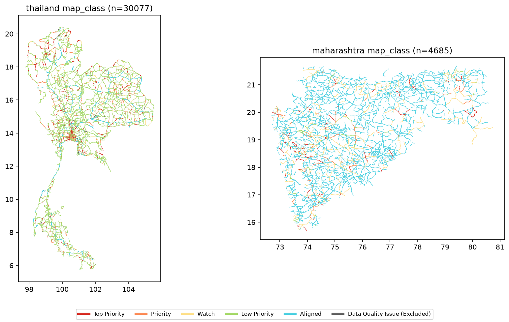

# ADB AI for Safer Roads, Safer Speeds Challenge

A submission for the Asian Development Bank's AI for Safer Roads, Safer Speeds Challenge.

## Submission deliverables

| Deliverable | Description | Where to find it |
|---|---|---|
| Analytical model | Documented code, methodology, and evaluation | [`src/`](src/), [`PIPELINE.md`](PIPELINE.md), [`notebooks/PIPELINE.ipynb`](notebooks/PIPELINE.ipynb), and the Methodology section below |
| Speed Safety Score | Per-segment classification (0-100 score, priority class, review track) | [`data/processed/segments_v_safe.parquet`](data/processed/segments_v_safe.parquet) (`safety_score`, `priority_class`, `review_track`, `score_explanation`); CSV exports in [`outputs/`](outputs/); plain-language explainer [`docs/speed_safety_score.md`](docs/speed_safety_score.md) |
| Geospatial visualization | Interactive map of Speed-Unsafe Segments | Live map: https://iiokentaro.github.io/adb-ai-for-safer-roads-safer-speeds-challenge/ ([`docs/index.html`](docs/index.html) + [`docs/segments_priority.pmtiles`](docs/segments_priority.pmtiles)) |

Interactive map: https://iiokentaro.github.io/adb-ai-for-safer-roads-safer-speeds-challenge/
Speed Safety Score, in plain language (1-page explainer): [`docs/speed_safety_score.md`](docs/speed_safety_score.md)

## Overview

What this solves: whether the current posted speed limit (`SpeedLimit`) is aligned with Safe System principles (the speed at which a person will not die even if struck) is evaluated per segment, to identify segments where the speed limit should be reviewed with priority. The question is whether the posted speed limit on the road is appropriate, not whether individual drivers are speeding (a distinction the organizers' overview document explicitly states).

The core deliverable is a priority ranking based on misalignment; V_safe (the safe speed that should apply) is merely an internal yardstick. Specifically:

1. Without using `SpeedLimit` or observed speed at all, `V_safe` for each segment is computed purely from Safe System theory (specific VRU detection × road separation structure × intersection proximity → collision type → safe speed). A VRU exposure level (a composite score of population density, POI density, and related signals) is computed separately and used exclusively for prioritizing countermeasure locations (discussed below).
2. `misalignment = SpeedLimit − V_safe` is computed, and used as the primary axis to find segments where the posted speed limit exceeds V_safe.

Why the speed limit to be reviewed is not decided directly from observed speed (`F85thPercentileSpeed`): as the organizers' Methodology Warning explicitly cautions, concluding that a high observed 85th-percentile speed alone requires lowering the limit is dangerous if the road was originally designed for high-speed travel. Observed speed is retained only as diagnostic information (`operating_gap`) on how the segment is actually being driven, and is never mixed into the computation of `V_safe` or the primary misalignment score (`src/safe_speed.py` structurally guarantees that it takes neither `speed_limit` nor observed speed as arguments; details below).

Scope: of the data provided for Thailand (`ADB_Innovation_Thailand`) and Maharashtra (`ADB_Innovation_Maharashtra`), the 15,121 segments for which speed data could be obtained (about 21.6% of all 69,966 segments). Note that because the P1-0 influence-zone localization (below) geometrically splits long segments into affected/unaffected portions, the final output `segments_v_safe.parquet` has 34,762 rows (30,077 Thailand, 4,685 Maharashtra, of which the 641 rows with `data_quality_flag='invalid_speed'` are all Thailand). Unless otherwise noted, the distributions/ratios/counts below are aggregated over this 34,762-row output (34,121 valid rows).

## Regions

The same pipeline and the same Speed Safety Score were applied as-is to both Thailand and Maharashtra (no country-specific hand-tuned parameters).

- Thailand: in the priority segments (`Review Needed` 6,031 + `Field Verification Needed` 456, 6,487 segments in total), the misalignment (speed limit − V_safe) averages a very large +54.3 km/h, distributed broadly and roughly evenly between rural and urban areas (RURAL 50.5% / URBAN 49.5%). The essence of the problem is that posted speed limits are set far above Safe System thresholds.
- Maharashtra: in the priority segments (`Review Needed` 1,002 + `Field Verification Needed` 99, 1,101 segments in total), the misalignment averages +11.0 km/h - far smaller than Thailand's (though still positive). It is not a contradiction for segments with small misalignment to appear on the priority list - the Speed Safety Score adds points not just for misalignment (0.50) but also for exposure (0.35) and confidence (0.15), so a segment with small misalignment but high exposure or low data confidence can still accumulate a high score. Indeed, 74.0% of Maharashtra's priority segments are concentrated in rural areas (RURAL). The essence of the problem is less uniformly excessive posted limits, as in Thailand, and closer to uncertain rural exposure (exposure raised via the safety-side correction) - for this group, the reason for prioritization should be checked per segment via `score_explanation`, rather than relying on the magnitude of misalignment itself.

The same logic (Safe System × VRU exposure × data confidence) produced two honestly different answers depending on the actual input data for each country - this is evidence that a general-purpose method reflected local realities as a result, rather than a story crafted after the fact for each country/region. Note that the share of `Field Verification Needed` is close between the two countries (Maharashtra 9.1% vs. Thailand 7.3%).

## Considerations in this submission

1. Observed speed is never mixed into the computation of V_safe. The V_safe computation function in `src/safe_speed.py` is designed to take neither `speed_limit` nor observed speed as arguments at all (structurally impossible to mix in). This is a direct response to the organizer's Methodology Warning (against shortcutting from high observed speed to a danger conclusion), ruling out from the start the false causal claim that high operating speed alone implies danger.
2. VRU exposure is evaluated through separate tracks for urban and rural areas. In rural areas, OSM/Mapillary coverage itself is extremely thin, and absence of an exposure signal does not imply absence of exposure. Because rural areas often have to rely on population density alone, a separate safety-side correction (`apply_rural_safety_margin`) is applied, treating the very absence of structure as a risk factor - measuring rural areas on the same scale as urban areas would overlook this asymmetry.
3. Collision type is decided solely by specific VRU detection and physical separation. `is_vru` (a source-independent VRU trigger) is the sole basis for the `pedestrian` (30 km/h) classification, and the composite score based on population density etc. (`exposure_level`) is demoted to countermeasure-location prioritization only (see V_safe design below). `is_vru` becomes true if either (a) Mapillary has actually detected a school-zone sign, crosswalk marking, or bicycle marking nearby (`is_mapillary_vru`), or (b) an OSM school node (`amenity=school`) is nearby. OSM schools are included because grade separation between schools and non-access-controlled roads is rare, and Mapillary coverage is not comprehensive either, so the judgment was made that the mere presence of a school should be treated as at-grade VRU evidence (school-zone signage and OSM school nodes are different evidence types, both indicating an on-road VRU collision point). Note that schools are also counted on the exposure side (`osm_poi_category_count`), so they affect both the V_safe axis and the exposure axis (double counting is permitted) - this is the same policy as for existing Mapillary VRUs. The reason this double counting is not corrected is not an ad-hoc compromise but a deliberate design decision; see Conceptual defense of double-counting near schools under Known limitations below for details. Motorways have the physical exception of being fully access-controlled, and `classify_collision_type` assigns a separated-type safe speed regardless of `is_vru` unless the motorway tag is suspect. `is_vru` is forced to False when `is_separated==True`/motorway/trunk. Furthermore, within a 300 m buffer of intersections (`highway=traffic_signals`/`junction=yes`), V_safe is capped post hoc at 50 km/h (`junction_speed_cap.py`, applied even under plain `is_separated`, but excluded for `road_class=='motorway'` and for segments matched to a grade-separated OSM way (`is_grade_separated`, bridge/tunnel/layer!=0) - a junction near a motorway or a flyover/underpass is a grade-separated interchange with no at-grade conflict on that segment).
4. `SpeedLimit` is not taken at face value; it is sorted by record plausibility. Priority segments are split into two tracks - `Review Needed` (the record is trustworthy → a candidate for policy review) and `Field Verification Needed` (the record itself looks suspect → the sign should first be checked on site) - so that segments suspected of a recording error are not mixed in with policy recommendations.
5. Road-environment-specific Power Model exponents are used for fatality-reduction estimates. Using a single exponent (e.g., a uniform 3.5 for all roads) would overestimate urban benefits. Environment-specific exponents from Cameron & Elvik (2010) are used (rural 4.1 / urban 2.6), and for the urban point estimate a wide confidence interval (0.3–4.9) is also reported to prevent overconfidence (details in the Fatality reduction estimate section).

## Data source and license

- Data provided: Thailand (`ADB_Innovation_Thailand`, 55,884 segments), Maharashtra (`ADB_Innovation_Maharashtra`, 14,082 segments). Both CSV and GeoJSON were provided; GeoJSON is treated as the primary data source (because it carries the full `LineString` geometry for each segment, whereas the CSV only carries start/end coordinate strings in `StreetImageLink`). Row order and `OBJECTID` have been confirmed to match exactly between the CSV and GeoJSON.
- Column names differ between Thailand and Maharashtra (Thailand: `OvertureID`, `ProvinceID`, `InvPercentile`, etc.; Maharashtra: `DISSOLVE_ID`, `class`, `subtype`, `UrbanPC`, `Pass`, `ExcludeFromSpeedSPI`, etc.). Renaming to a common schema is consolidated in `src/schema.py`.
- The `AnalysisStatus` column (`Valid`/`Not Included`) almost entirely determines whether the speed-related columns (`SpeedLimit`, `MedianSpeed`, `F85thPercentileSpeed`, etc.) are populated: 11,544/55,884 rows (about 21%) for Thailand and 4,010/14,082 rows (about 28%) for Maharashtra are `Valid`. For Maharashtra, even among `Valid` rows, the 433 rows with `ExcludeFromSpeedSPI=1` are left with `SpeedLimit` missing (these should be excluded from analysis).
- `LandUse` is only RURAL/URBAN (no spelling variants). `RoadClass` has four values - motorway/trunk/primary/secondary (no spelling variants). `F85thPercentileSpeed >= MedianSpeed` holds for every Thailand row; for Maharashtra only 1 row is reversed.
- The coordinate order in `StreetImageLink` is lon,lat,lon,lat (Thailand example: `103.47,14.84,103.44,14.87`; Maharashtra example: `73.55,16.28,73.53,16.24`). The GeoJSON coordinate order also follows the GeoJSON spec, `[lon, lat]`.
- Coordinate ranges: Thailand lon 97.7–105.5 / lat 5.7–20.4; Maharashtra lon 72.7–80.8 / lat 15.6–21.9 (consistent with the land extent). CRS is EPSG:4326.

### Auxiliary data sources

`src/auxiliary_data.py`. All are free, require no authentication, and use fixed URLs, so they are reproducible (there is no dependency on paid APIs such as Google Street View).

| Data | Source | Resolution/Format | License | Notes |
|---|---|---|---|---|
| Segment geometry/attributes | Overture Maps (CSV/GeoJSON provided by this competition) | LineString, EPSG:4326 | ODbL (OSM attribution required) | `data/raw/` |
| Population density | [WorldPop](https://hub.worldpop.org/) (`https://data.worldpop.org/GIS/Population/Global_2000_2020/{year}/{ISO3}/{iso3}_ppp_{year}.tif`) | GeoTIFF, 3 arc-seconds (~100 m near the equator) | CC BY 4.0 | Thailand (THA) 296 MB, India (IND; since there is no standalone ISO3 for Maharashtra, it is cut from the national data) 1.8 GB. Confirmed a 200 response with no authentication required via `curl -I`. GHSL was considered but rejected because bulk download was in preparation, with only a tile-by-tile click UI, which is less reproducible |
| OSM POIs (schools, markets, bus stops, shops, etc.) | OpenStreetMap (`osmnx.features_from_bbox`) | Vector (points/polygons) | ODbL (attribution required) | Confirmed retrievable via a Bangkok sample (697 schools, 332 markets, 3,487 bus stops, 9,075 shops) |
| Pedestrian structures (footway/crossing, etc.) | OpenStreetMap (`osmnx.features_from_bbox`) | Vector | ODbL | Confirmed during coverage checks. Coverage in rural areas is minimal |
| Street imagery detections (VRU map features) | [Mapillary](https://www.mapillary.com/) Graph API v4 (`GET graph.mapillary.com/map_features`) | Point detections (`id`, `object_value`, `geometry`) | CC BY-SA 4.0 (attribution required) | Urban-only in practice. Requires your own API token (`MAPILLARY_TOKEN` in `.env`, excluded from the repository). Raw JSON is kept out of git; fetch with `notebooks/fetch_mapillary_features.ipynb` and place under `data/mapillary/` (see `data/mapillary/note.md`). We query 26 VRU-related `object_value` categories only (listed below); speed-limit signs are omitted from the fetch set.

Mapillary `/map_features` object_values fetched (`src/fetch_mapillary_features.py`; mapped to segment flags in `src/poi_categories.py`):

| Category | `object_value` strings |
|---|---|
| School-zone signage | `warning--school-zone--g2`, `regulatory--end-of-school-zone--g1` |
| Hospital | `information--hospital--g1` |
| Crosswalk / pedestrian crossing infrastructure | `construction--flat--crosswalk-plain`, `marking--discrete--crosswalk-zebra`, `regulatory--in-street-pedestrian-crossing--g1`, `regulatory--pedestrians-priority-zone--g1`, `regulatory--pedestrians-push-button--g1`, `regulatory--pedestrians-push-button--g2`, `regulatory--yield-or-stop-for-pedestrians--g1`, `warning--pedestrians-crossing--g1`, `warning--pedestrians-crossing--g4` … `g12` (10 warning variants) |
| Shared-path / bicycle–pedestrian regulatory signs | `regulatory--pedestrians-bicycles-permitted--g1`, `regulatory--shared-path-bicycles-and-pedestrians--g1`, `regulatory--shared-path-pedestrians-and-bicycles--g1`, `warning--dual-path-cyclists-and-pedestrians--g1` |
| Bicycle markings / fixtures | `marking--discrete--symbol--bicycle`, `object--bike-rack` |

These detections feed `is_mapillary_vru` (school-zone sign or crosswalk marking or bicycle marking within the segment proximity buffer) and the urban exposure composite. They are not used to impute missing posted speed limits.

Attribution text (to be stated in the final submission): "Contains OpenStreetMap data, © OpenStreetMap contributors, ODbL" / "Contains Overture Maps Foundation data, ODbL" / "Mapillary imagery © Mapillary contributors, CC BY-SA 4.0" / "WorldPop population data, CC BY 4.0".

## Geometry check

- `src/geometry.py`: a utility that assigns each segment's representative point (`LineString.interpolate(0.5, normalized=True)`, i.e. the midpoint along the line at half the segment length) and its UTM EPSG code.
- Found that Thailand straddles UTM 47N (44,933 segments) / 48N (10,951 segments), while Maharashtra straddles UTM 43N (12,245 segments) / 44N (1,837 segments, a zone not mentioned in the planning documents). Distance calculations project each segment individually into the appropriate zone (`to_utm_by_zone`).
- The representative points were plotted per country and visually verified (`outputs/representative_points.png`). Both Thailand's characteristic southern peninsula shape and Maharashtra's shape were correctly reproduced, with no swap of coordinate order (lon, lat).
- Against the configured bounds check (Thailand lon 97–106 / lat 6–21), 153 records were flagged as outliers, but on inspection all were legitimate data from southern Thailand (near the Malaysian border, latitude 5.7–6.0); the actual number of anomalies was zero.

## Inventory of Safe System inputs

`src/safe_system_inputs.py`. Covers the 15,554 segments (11,544 Thailand, 4,010 Maharashtra) with `AnalysisStatus=='Valid'`.

- Proxy for infrastructure protection level / collision type: a cross-tabulation of `RoadClass` (motorway/trunk/primary/secondary) × `LandUse` (URBAN/RURAL) was performed. Urban × high-class road (motorway/trunk/primary, segments where pedestrian collision risk can dominate) accounts for 23.4% overall (25.1% Thailand, 18.3% Maharashtra). `UrbanPC` (a continuous value 0–1) is available for Maharashtra only.
- Observed speed is diagnostic only: `F85thPercentileSpeed` was box-plotted by `road_class`/`land_use` (`outputs/f85_by_category.png`). A scatter plot of `SpeedLimit` vs. `F85thPercentileSpeed` (`outputs/speedlimit_vs_f85_diagnostic.png`) is diagnostic material for misalignment only and is not used to compute the target speed. Finding: in 45% of segments the observed F85 exceeds the speed limit, and 11% exceed it by 20 km/h or more. Conversely, 14% fall short of the speed limit by 20 km/h or more.
- Data confidence: the bottom 25% of `sample_size_total` (<about 50,617) is used as the candidate threshold for low confidence. Low-sample segments have a 39.3% rate of `PercentOverLimit` taking the extreme values 0 or 1 (vs. 30.7% for high-sample segments), consistent with the organizers' warning that aggregates become unstable with smaller samples.
- Data quality bug found: in Maharashtra's GeoJSON the `SpeedLimit` column values were stored as JSON strings (e.g., "55"), with only missing values as None (other numeric columns were normal floats). Corrected in `src/schema.py` via `pd.to_numeric`.
- Missing inputs: neither country has direct data on VRU (pedestrian, two-wheeler, etc.) exposure. `RoadClass`/`LandUse`/`UrbanPC` are only crude proxies. Population density, OSM pedestrian structures, POIs, etc. need to be supplemented (to be determined during coverage checks).

## Setup

```bash
python -m venv.venv
source.venv/bin/activate
pip install -r requirements.txt
```

## How to run

Actually verified in a clean environment (cloned into a separate directory with a fresh venv). There are two paths:

### Fast path (recommended for reviewers, ~10 seconds)

`data/processed/segments_v_safe.parquet` (34,762 rows, obtained by P1-0-localizing the 15,121 segments, with `V_safe`, misalignment, Speed Safety Score, priority class, and the Review Needed / Field Verification Needed split all already computed) is committed to the repository, so the map, CSV, GeoJSON/GPKG, and sensitivity analysis can all be regenerated from this single file, without downloading either the raw data (GeoJSON, uncommitted because it exceeds 130 MB) or the WorldPop rasters (about 2 GB, uncommitted).

```bash
python -m venv.venv && source.venv/bin/activate
pip install -r requirements.txt
python src/quick_reproduce.py
```

This alone regenerates `outputs/priority_map.html` (interactive map), `outputs/segments_priority.geojson`/`.gpkg` (ESRI-compatible, full resolution), `outputs/priority_map_static.png` (static fallback), `outputs/priority_review_needed.csv`/`priority_field_check.csv` (the two priority-segment lists), and the sensitivity-analysis results. `src/quick_reproduce.py` is designed never to call `schema.load_target` (which reads the raw data) at all (see the module docstring for details).

### Full reproduction path (if you want to verify the computation process itself)

The path that rebuilds `data/processed/segments_v_safe.parquet` itself from scratch. An honest warning about time required: step 2 below involves fetching the WorldPop rasters (a temporary download of 296 MB for Thailand, 1.8 GB nationwide for India), which can take anywhere from a few minutes to tens of minutes depending on network conditions. The OSM POI/crossing-structure/road-network extraction results (`data/processed/osm_*.parquet`) are already committed to the repository as a cache, so the OSM pbf extraction step (about 55 minutes) needed during OSM extraction does not need to be re-run (refer to the commented-out code in `src/exposure_signals.py`/`src/road_separation.py` only if you want to re-extract).

```bash
# 1. Place the raw data (GeoJSON). It is not committed under data/raw/ because it
# exceeds 130MB, but identical content (confirmed byte-identical) is committed under QGIS/.
mkdir -p data/raw
cp QGIS/ADB_Innovation_Thailand.geojson QGIS/ADB_Innovation_Maharashtra.geojson data/raw/

# 2. Fetch the WorldPop population density rasters (heavy, a few minutes to tens of minutes)
python -c "from fetch_worldpop import fetch_thailand, fetch_maharashtra; fetch_thailand; fetch_maharashtra"

# 3. Run the full pipeline (OSM extraction is cached and will not be re-run)
python src/build_v_safe.py
```

If you want to check each step individually, refer to `notebooks/PIPELINE.ipynb` (Phase 0–4 end-to-end, with the latest logic including `is_vru` (the VRU trigger including OSM schools), the intersection cap, and P1-0 localization - recommended for reviewers).

### Checking the deliverables without running anything

If you just want to look at the results without running anything:

- Map: the hosted interactive map is at https://iiokentaro.github.io/adb-ai-for-safer-roads-safer-speeds-challenge/ (MapLibre GL JS + PMTiles, `docs/index.html`). A folium/Leaflet version can also be regenerated locally via `python src/quick_reproduce.py` (`outputs/priority_map.html`), but it is not committed since its full-resolution geometry exceeds GitHub's 100MB file limit.
- Static summary: the image under Priority segment map (static summary) below.
- Representative segment case studies: see Representative segment case studies below.

## Priority segment map (static summary)



Red = Top Priority, orange = Priority, yellow = Watch, yellow-green = Low Priority, green = Aligned (`priority_class` is computed independently per country. `No Issue` is split, for display purposes only, into Aligned (`misalignment<=0`, i.e. the speed limit is already at or below V_safe, no room to lower it) and Low Priority (`misalignment>0`); the underlying data column `priority_class` itself is unchanged). The interactive version is hosted at https://iiokentaro.github.io/adb-ai-for-safer-roads-safer-speeds-challenge/ (`docs/index.html`); it shows all priority classes by default with click-through popups (score, class, review track, explanation) and toggleable class filters.

## Methodology

1. Computing V_safe (the safe speed that should apply): without using `SpeedLimit` (the posted speed limit) or observed speed at all, the target safe speed for each segment is decided purely from Safe System thinking (the speed at which a person will not die even if struck). Specifically, the collision type (pedestrian / head-on / separated) is determined from VRU detection (`is_vru` - school-zone signage, crosswalk markings, and bicycle markings detected by Mapillary street imagery, or an OSM school node) and the road's separation structure (whether there is median separation, `is_separated`), and a fixed safe speed (30 / 70 / 80–100 km/h, per WHO Safe System criteria) is assigned per collision type. Furthermore, segments within 300 m of an intersection (`highway=traffic_signals`/`junction=yes`) have V_safe capped post hoc at 50 km/h (side-impact type), except motorway and grade-separated segments (flyover/underpass), for which a nearby junction is not an at-grade conflict. A composite VRU exposure level (High/Medium/Low) based on population density, POI density, etc. is computed separately, but it is not used for V_safe itself - it is used solely for prioritization in the Speed Safety Score (see the V_safe design section for details).
2. Computing misalignment: `misalignment = speed limit − V_safe`. A positive value means the posted speed limit exceeds V_safe - i.e., high speed despite the presence of VRUs, and a candidate for review priority. Negative values (possibly over-regulation) are recorded in a separate column but are not used for priority. Comparison against observed speed (F85) is kept fully separate as a different axis (`operating_gap`, a diagnostic of how the segment is actually being driven).
3. Integrating the Speed Safety Score: the three axes - magnitude of misalignment, VRU exposure level, and data confidence - are combined into a single score (0–100) via a weighted average (details in the next section).
4. Sorting by plausibility: whether the `SpeedLimit` record itself is trustworthy is checked using only internal consistency (since there is no external, official speed-limit dataset), and priority segments are split into `Review Needed` (the record is trustworthy → a candidate for policy review) and `Field Verification Needed` (the record itself looks suspect → the sign should first be checked on site).
5. Mapping/listing: the priority classes and sorting results are turned into a map that transport ministry staff can open in a browser (`outputs/priority_map.html`) and into CSV lists.
6. Fatality reduction estimate (Power Model): for each segment, the estimated reduction rate in fatal crashes if the operating speed were lowered to V_safe is computed using road-environment-specific exponents (Cameron & Elvik 2010), and is attached as a quantitative benefit metric in addition to priority (details in the next section). This is not used for priority itself, but is included as supplementary information.

## Definition of the Speed Safety Score

The three axes (why these three):

| Axis | Content | Why this axis |
|---|---|---|
| (a) Magnitude of misalignment | How much higher the speed limit is than V_safe (km/h; 60 km/h or more is treated as the same maximum weight) | This is the core question of the deliverable: where speed-limit review should start |
| (b) VRU exposure level | How likely pedestrians, cyclists, etc. are to be present (High/Medium/Low) | Even with the same magnitude of misalignment, priority should be higher where people are present (this competition's purpose = VRU protection) |
| (c) Data confidence | Combines the reliability of the exposure estimate, the separation-structure determination, and the `SpeedLimit` record into a single measure (High/Medium/Low) | Putting segments with suspect data straight at the top of the priority list risks the whole list being dismissed because the underlying records look unreliable, undermining its overall credibility |

Integration method (a transparent weighted sum; no black-box machine learning is used):

```
safety_score = 100 × (0.50 × misalignment_score + 0.35 × exposure_score + 0.15 × confidence_score)
```

Each axis is normalized to 0–1 before weighting (misalignment is scaled 0–1 with a cap at 60 km/h; exposure is Low=0/Medium=0.5/High=1; confidence is High=1/Medium=0.67/Low=0.33). Rationale for the weights: misalignment (0.50) is given the largest weight because the core of this deliverable is prioritizing speed-limit review (the other two axes reinforce misalignment). Exposure (0.35) is given the second-largest weight because VRU protection is the purpose of this competition, and segments with high exposure should be prioritized even at the same level of misalignment. Confidence (0.15) is given the smallest weight because mechanically dropping a genuinely dangerous segment from top priority just because the data is uncertain would violate the Safe System principle (err on the side of safety when uncertain); confidence is kept as a weight for breaking ties among otherwise similar segments. These weights are arbitrary assumptions chosen by the analysis team (validated via sensitivity analysis, discussed below).

Per-segment explanation text (`score_explanation`): a plain-language explanation of why each segment received its score is generated per segment, for example: "Posted speed limit is 40 km/h above the safe speed (V_safe). VRU exposure: Medium. Data confidence: High." It is included both in the map popups and in the CSV.

Priority classes (four levels, computed independently for Thailand and Maharashtra):

| Class | Criterion | Meaning / action the transport ministry should take |
|---|---|---|
| Top Priority | Top 3% of each (country, land_use) cell | Segments to be examined immediately. 2,805 Thailand, 243 Maharashtra, 3,048 total |
| Priority | Top 3–10% of each (country, land_use) cell | Segments to be addressed next. 1,084 Thailand, 308 Maharashtra, 1,392 total |
| Watch | Top 10–20% of each (country, land_use) cell | No action needed now, but under observation. 2,598 Thailand, 550 Maharashtra, 3,148 total |
| No Issue | Everything else (bottom 80%+ of each cell) | No action needed. 26,533 segments total (the 641 `invalid_speed` rows are a separate category) |

Threshold computation is performed independently within four (country, land_use) cells. This is consistent with the design of `exposure_level.py`, which already treats urban/rural as separate tracks (a different signal set, different quantiles): cutting percentiles per country alone would let urban and rural segments compete within the same score distribution, letting one push the other out of the top 3% bracket. `safety_score.add_safety_score`, `exposure_level.add_exposure_level`, and `priority_lists.add_priority_environment_rank` all compute independently in four cells by (country, land_use) (or (country, power_environment_used)). For Thailand URBAN, the Priority class is empty (0 segments) due to a threshold tie (1,612 Top Priority / 0 Priority / 1,597 Watch): a large number of segments are classified `pedestrian` (V_safe=30) via OSM schools, so `misalignment_magnitude` saturates at 60 km/h and `safety_score` values cluster into discrete values, causing the 90th- and 97th-percentile values to coincide (a statistical artifact; see Known limitations below).

Reason for computing independently per country and per land_use: because Thailand and Maharashtra are independent projects funded from different sources, cutting percentiles over the two countries as a single pooled population would let Thailand - whose misalignment and exposure scores are overall higher - monopolize the Top Priority/Priority brackets, leaving Maharashtra with no (relatively) priority segments at all. The same reasoning applies between urban and rural areas within a country, so percentiles are cut independently within each of the four (country, land_use) cells.

The difference between Review Needed and Field Verification Needed (an axis separate from priority class):

Segments whose priority class is anything other than `No Issue` (Top Priority/Priority/Watch) are further split into two tracks.

- Review Needed (7,033 segments): the `SpeedLimit` record itself is trustworthy (not a statistical outlier, and not greatly inconsistent with observed speed). The primary candidate list for policy review such as lowering the speed limit.
- Field Verification Needed (555 segments): the `SpeedLimit` record itself looks suspect (a statistical outlier compared to other segments of the same road class/land use, or inconsistent with observed speed by 30 km/h or more). Because it cannot be determined whether a large misalignment reflects a genuine review target or simply a recording error, on-site verification of the sign is prioritized first.

It is important not to mix these two tracks. Because `SpeedLimit` is an estimated value in the provided data with no way to verify it against an external official speed-limit dataset (a constraint explicitly stated in the FAQ as well), mixing suspect-record segments into the Review Needed list would dilute the priority list with cases that turn out to be recording errors, undermining the transport ministry's trust in it.

## Fatality reduction estimate (Power Model, road-environment-specific exponents)

To attach a quantitative benefit metric (estimated reduction rate in fatal crashes if speed were lowered to V_safe) to the priority-segment list beyond sorting by misalignment magnitude, a road-environment-specific refinement of the Nilsson Power Model was implemented (Cameron & Elvik 2010; the specific exponent values are from Elvik (2009) TOI report 1034/2009 Table 8, with sources and coefficients stored in `src/cameron_and_elvik.json`) (`src/fatality_reduction.py`).

Formula:

```
delta_fatal_percent = (1 − (V_post / V_op) ^ p) × 100
```

- `V_op` (pre-intervention) = `median_speed` (current operating speed)
- `V_post` (post-intervention) = `v_safe` (the safe speed that should apply; the theoretical value if operating speed converges to V_safe. See also limitation (c) below.)
- `p` (exponent) = varies by road environment

Definition of the category used (to avoid ambiguity): Elvik (2009) Table 8 has six categories by casualty severity, but this analysis uses fatal accidents (crashes involving a fatality, a per-crash metric). The fatalities exponent (per person killed) differs in both value and confidence interval (`cameron_and_elvik.json` stores both, but only the fatal-accidents exponent is used).

Values of the exponent (p) (separate tracks for urban/rural, the same two-track design as the safe-speed computation):

| Road environment | Applies to | Exponent p (point estimate) | 95% CI |
|---|---|---|---|
| rural_freeway | `land_use=='RURAL'`, and `road_class=='motorway'` (regardless of land_use; the motorway exponent falls into the high-speed group, the same treatment as the motorway exception in the V_safe computation) | 4.1 | 2.9–5.3 |
| urban_residential | `land_use=='URBAN'` and non-motorway | 2.6 | 0.3–4.9 |

Using a lower exponent for urban than for rural avoids overestimating urban benefits (a higher exponent produces a larger reduction rate for the same speed gap).

Results (priority Review Needed list, n=7,033, the `delta_fatal_percent` column of `outputs/priority_review_needed.csv`):

| Road environment | n (segments with positive reduction effect) | Mean point estimate | Mean 95% CI (lower–upper) |
|---|---|---|---|
| rural_freeway | 3,631 | 92.7% | 86.5%–95.5% |
| urban_residential | 2,906 | 74.8% | 16.0%–90.5% |

92.9% (6,537/7,033) of the Review Needed list shows a positive reduction effect (the remaining 7.1% are excluded from the reduction target because `median_speed<=v_safe`; see Meaning of positive/negative below). The point estimate alone is not shown by itself - the lower bound of the urban confidence interval (16.0%) is far lower than the point estimate (74.8%), and the width of the confidence interval itself is the numerical basis for limitation (b) below, that the urban point estimate should not be overtrusted. In addition to `delta_fatal_percent` (point estimate), `delta_fatal_percent_ci_low`/`delta_fatal_percent_ci_high` (the lower/upper CI bounds recomputed with the same formula) and `power_exponent_used`/`power_environment_used` (the exponent and environment used, for traceability) are attached to all priority-segment outputs (CSV, GeoJSON/GPKG, map popups).

Meaning of positive/negative (a mechanism to avoid overclaiming): in segments where `median_speed <= v_safe` (the current operating speed is already at or below V_safe), `delta_fatal_percent` becomes zero or negative. That marks the segment as excluded from the reduction target because there is already no speed-related problem to address. 7.1% (496/7,033) of the Review Needed list falls into this case, and is naturally excluded from the benefit aggregation (table above). 92.9% of segments show a positive reduction effect because `is_vru` (the VRU trigger, including OSM schools) classifies many segments - including rural ones - as `pedestrian` (V_safe=30 km/h), increasing the number of segments where the current `median_speed` exceeds V_safe (i.e., segments with room for reduction). This reflects unifying the basis for V_safe around concrete VRU evidence (Mapillary detection + OSM schools). Note that in segments where `median_speed` is extremely low compared to V_safe (e.g., due to congestion), because this formula takes a power of a ratio, even though the sign indicates no benefit, the absolute value of the number can become unrealistically large (e.g., minus several hundred percent) - this is a mathematical artifact of extrapolating the Power Model to segments with extreme speed ratios; for segments where `delta_fatal_percent` is zero or negative, this column is treated only as a sign (whether there is a benefit or not), and its absolute value is not interpreted or presented as the magnitude of benefit.

Three limitations:

- (a) The limitation of a single speed parameter in urban areas: Cameron & Elvik (2010) conclude that on urban roads, average speed alone cannot capture the effect of the speed distribution (speed variance, the share exceeding the limit). Because this analysis's benefit estimate is based only on `median_speed` (a proxy for typical operating speed), the urban benefit estimate is an approximation and should not be overtrusted. Indeed, 219 segments in the Review Needed list show `delta_fatal_percent<=0` (no benefit) even though F85 (observed 85th-percentile speed) exceeds V_safe, because median_speed is at or below V_safe - precisely a case where this limitation surfaces.
- (b) Width of the confidence interval: the urban exponent's 95% CI is very wide, 0.3–4.9 (see table above; the mean of the CI ranges from 16.0% to 90.5%), far more uncertain than rural (2.9–5.3). The urban point estimate (74.8%) is never presented as a definitive benefit on its own - it is always reported together with its confidence interval.
- (c) Feasibility of intervention: this estimate is the theoretical value if operating speed were lowered to V_safe - merely changing the speed sign (`SpeedLimit`) offers no guarantee that the operating speed will actually fall that far. Whether it actually falls is expected to be lower for segments with a larger `operating_gap` (the diagnostic gap between F85 and V_safe, this analysis's existing physical-countermeasure diagnostic axis). No claim is made that changing the sign will save a specific number of lives.

## Splitting the priority list into urban/rural (`priority_urban` / `priority_rural`)

Until now, the priority-segment lists (Review Needed, Field Verification Needed) mixed Thailand and Maharashtra, urban and rural, all into one list. From here, the output is split one level further, producing a separate urban list (`priority_urban`) and rural list (`priority_rural`) (`outputs/priority_urban.csv` / `outputs/priority_rural.csv`, `src/priority_lists.py`).

Why split them: VRU exposure is computed on separate urban and rural tracks from the outset (rural areas have thin OSM/Mapillary coverage and rely heavily on population density alone as a different measure, and the safety-side correction `apply_rural_safety_margin` also addresses this asymmetry). Merging this at the end into a single ranking would dilute the meaning of the separate-track design - there is no way, without external ground-truth data, to tell whether fewer rural priority segments reflect genuinely lower risk or an artifact of forcing two different measures into one ranking. Rather than carry this unverifiable asymmetry into a single list, the choice was made to split the tracks from the start, so the problem never arises in the first place. The computation of `priority_class`/`safety_score` itself is unchanged (this section only changes how the output is arranged). The split into the two lists simply reuses `power_environment_used` (`rural_freeway`/`urban_residential`, with motorway treated as `rural_freeway` regardless of land_use), already assigned to each segment in P0-1; no new environment-classification logic was created.

`rank_within_environment` (rank within track) - data confidence is not used as a ranking penalty: a rank that is meaningful only within each list, computed using only misalignment (0.50) and exposure (0.35) from the three Speed Safety Score axes, renormalized while preserving their ratio (58.8%:41.2%). Data confidence (0.15) is deliberately excluded from this - because if rural segments with the safety-side correction (segments judged high-exposure precisely because exposure is uncertain) were pushed down in rank merely for low confidence, that would contradict the design principle that absence of structure is itself a risk signal. Confidence does not move the rank; it is left only as a note in each segment's `confidence_note` column (exposure uncertain, field verification recommended). Rank is computed independently per (country, environment). Validation: among the tied-for-first segments in the rural list (1,882 segments pooled across both countries), 731 (38.8%) have `confidence_level='low'`, and among the tied-for-first segments in the urban list (411 segments), 43 (10.5%) have `confidence_level='low'` - confirming that low confidence alone is not excluding segments from the top rank.

`delta_fatal_abs` (cross-track comparable benefit metric): `delta_fatal_abs = delta_fatal_percent ÷ 100 × sample_size_total`. This is a relative metric weighted by `sample_size_total` (the number of speed-probe samples, a proxy for traffic volume), capturing the rule that, for the same percentage reduction, higher traffic volume implies a larger total effect, in a way comparable across urban and rural without shifting units. Neither the Thailand nor the Maharashtra data contains columns for observed crashes or fatalities, so there is no basis for a literal count of lives saved. Example: the segment with the largest `delta_fatal_abs` across both tracks is a Thailand urban motorway segment (about 30.38 million samples, 88.5% reduction rate); busy urban motorways emerge as priority candidates in cross-cutting budget-allocation discussions - however, the top of both tracks skews toward urban areas, reflecting traffic-volume scale differences between the two tracks (the median `sample_size_total` is about 21,410 for the rural list vs. about 200,291 for the urban list).

## Sensitivity analysis

In response to the ADB's Methodology Warning (to check dependence on sample density and methodological assumptions), `src/sensitivity_analysis.py` was used to examine how much the results depend on (1) sample density, (2) score-integration weights, and (3) the Power Model exponent used in the fatality-reduction estimate (P0-1). (1) and (2) look at the turnover in the Top Priority list (`priority_class`, top 3% per country, the pipeline documentation); both reuse `safety_score.add_safety_score` itself as-is (there is no separate simplified logic), comparing the overlap (recall/Jaccard) with the original Top Priority list. (3) creates no new formula; it simply aggregates the confidence-interval columns (`delta_fatal_percent_ci_low/high`) already computed per segment by `fatality_reduction.py`.

(1) Dependence on sample density : `priority_class` was recomputed using only the remaining segments (25,591/34,121) after excluding the bottom 25% of `sample_size_total` (threshold 8,099 samples), which was set as the low-confidence candidate threshold during initial data exploration. Of the original 3,048 Top Priority segments, 448 (14.7%) already belonged to this bottom 25% themselves - i.e., they were already low-sample segments. Recomputing on the remaining, higher-sample population yielded 2,600 Top Priority segments, and the overlap with the original 3,048 Top Priority segments was 2,600 segments (recall 85.3%, Jaccard 85.3%). The population (34,762 rows, via `is_vru`, including OSM schools) gives adequate per-cell sample counts, keeping sensitivity to low-sample exclusion at a moderate level (recall 85.3%) - the finding is that the bulk of the Top Priority list is not a low-sample artifact.

(2) Dependence on the choice of weights : the weights in (misalignment 0.50 / exposure 0.35 / confidence 0.15) were varied across five patterns to recompute the Top Priority list, and compared against the baseline.

| Weighting scenario | Top Priority count | Overlap with baseline | Recall | Jaccard |
|---|---|---|---|---|
| baseline (0.50/0.35/0.15) | 3,048 | 3,048 | 100.0% | 100.0% |
| misalignment-heavy (0.70/0.20/0.10) | 1,901 | 1,703 | 55.9% | 52.5% |
| exposure-heavy (0.30/0.55/0.15) | 3,132 | 3,044 | 99.9% | 97.1% |
| equal weights (0.33/0.33/0.34) | 2,933 | 2,830 | 92.8% | 89.8% |
| confidence-heavy (0.40/0.30/0.30) | 2,926 | 2,832 | 92.9% | 90.1% |

Conclusion: as long as misalignment remains the primary axis (0.50), the Top Priority list is broadly robust. The exposure-heavy, equal-weight, and confidence-heavy scenarios all have a high Jaccard of 89–97%, meaning little turnover in the Top Priority list. Only the `misalignment-heavy` scenario, which pushes misalignment as high as 0.70, drops to Jaccard 52.5% (recall 55.9%), with about half the list turning over - because many segments are classified `pedestrian` (V_safe=30) via OSM schools, saturating `misalignment_magnitude` at 60 km/h, so pushing the misalignment axis's weight to an extreme makes ranking within the saturated group unstable, since it is no longer divided by exposure/confidence. Thus the weighting 0.50/0.35/0.15 is reasonable as long as misalignment is not given disproportionate weight (around 0.5), but it must still be stated clearly that this remains an assumption with residual arbitrariness, chosen rather than learned from data.

(3) Dependence on the confidence interval of the Power Model exponent: how far the point estimates in the Fatality reduction estimate section (urban 74.8%, rural 92.7%) would swing if the 95% confidence interval of the Cameron & Elvik (2010) exponents themselves (urban 0.3–4.9, rural 2.9–5.3) is reflected was checked for the priority Review Needed segments with a positive reduction effect (n=6,537).

| Road environment | n | Mean CI lower bound | Mean point estimate | Mean CI upper bound |
|---|---|---|---|---|
| rural_freeway | 3,631 | 86.5% | 92.7% | 95.5% |
| urban_residential | 2,906 | 16.0% | 74.8% | 90.5% |

Conclusion: for rural (rural_freeway), the confidence interval is relatively narrow (86.5–95.5%), and the point estimate of 92.7% can be regarded as a broadly stable estimate. For urban (urban_residential), however, the confidence interval is very wide, 16.0–90.5%, and looking only at the point estimate of 74.8% risks overconfidence. This numerically substantiates limitation (b) in the Fatality reduction estimate section - that the urban benefit estimate is an approximation and should not be overtrusted - and is the basis for the policy of always presenting urban priority segments together with their confidence interval, rather than the point estimate alone.

## Known limitations

Because honestly stating limitations is itself part of what is being evaluated, the limitations identified are listed below.

- Limited scope of coverage: only the 15,121 segments with speed data are analyzed (34,762 rows in the output after P1-0 localization), which is only about 21.6% of the full provided data (55,884 Thailand segments, 14,082 Maharashtra segments, 69,966 total). For the remaining ~78% of segments, this analysis has nothing to say.
- `SpeedLimit`/`LandUse`/`RoadClass` are Overture-based estimates: they are derived from Overture Maps, with no way to verify them against an external official speed-limit dataset (a constraint explicitly stated in the organizers' FAQ as well). Sorting by plausibility mitigates this limitation but does not solve it - the Field Verification Needed list (555 segments) literally requires on-site verification, and this analysis alone cannot reach a conclusion.
- There is a lag in when the data was collected: the road network (Overture) is a snapshot as of December 2024 for Thailand and May 2025 for Maharashtra, while the auxiliary data (OSM POIs, crossing structures, road network) was collected as of June 2026. There is a lag of about 1–1.5 years, during which new roads, new facilities, and road improvements are not reflected.
- The separation-structure (`is_separated`) determination depends on OSM-side matching: segments that could not be spatially matched to the OSM road network default to the safety-side value not separated (meaning the separation status could not be confirmed). Because splitting long segments into short child segments (P1-0) raises the share of child segments that cannot be matched to an OSM road within 15 m, `is_separated_confidence='low'` accounts for a large share, 23,470 of the 34,762 output rows (67.5%) (roughly half-and-half on a pre-split, parent-segment basis). Motorways are also affected: 46 of 169 rows (43 in Thailand) fall into this case. While flagged distinctly as `is_separated_confidence='low'`, the underlying gap in the determination itself is not resolved, with the side effect that confidence for child segments broadly drops to `medium`.
- VRU exposure is only an indirect proxy: because there is no actual count data for pedestrians, cyclists, etc., it is estimated from indirect signals - population density, OSM POI density, and the presence of crossing structures. Rural areas in particular have extremely thin OSM/Mapillary coverage (0–4 OSM pedestrian-related tags and 0 Mapillary images in rural samples), so reliance on population density alone is common.
- `is_grade_separated` over-matches relative to a point-specific flyover check: the junction-cap exclusion (see Junction cap grade/motorway exclusion above) flags a whole segment as grade-separated if *any* of its matched OSM ways is bridge/tunnel/layer-tagged, which - given how often canal/river-crossing bridges are digitized as short standalone way objects in this data - ends up true for 20–44% of segments depending on country. This is a disclosed safety-side design choice, and the exclusion is broader than a flyover-only check at the intersection itself.
- `StreetImageLink` holds start/end coordinates for on-site verification: what is attached to the Field Verification Needed list is the segment's start/end coordinates; a separate step is needed to actually fetch imagery from Mapillary etc. Even where imagery can be obtained, it can confirm land use/road environment, but there is no guarantee the speed-limit sign itself appears in the image - imagery alone cannot definitively confirm whether `SpeedLimit` is correct.
- The Speed Safety Score weights are assumptions chosen by the analysis team: the weights misalignment 0.50 / exposure 0.35 / confidence 0.15 were set as assumptions by the analysis team and are not the only correct answer. The sensitivity analysis above shows that the Top Priority list is robust as long as misalignment retains a primary-axis-level weight (around 0.5) (Jaccard 87–97% even with exposure, equal, or confidence weighted heavily), but pushing misalignment as high as 0.70 causes about half the Top Priority list to turn over (Jaccard 52.6%) - it cannot be denied that some arbitrariness remains in the choice of these weights themselves.
- The priority-class thresholds (top 3%/10%/20% per country) are also a design choice: these are not natural thresholds derived from the data, but values back-calculated from the operational constraint of how many cases the transport ministry can address at once.
- Thresholds are tunable parameters, and their arbitrariness is operationally acceptable: the model's various thresholds (POI buffer distance, isochrone travel time, priority-class quantiles, misalignment cap, minimum segment length `MIN_PIECE_M`, etc.) are not values uniquely determined by the data but design choices. This arbitrariness cannot be fully eliminated, but these thresholds can be freely changed later. In actual operation, ADB and national transport authorities are expected to retune them to fit real-world constraints such as budget, staffing, and how many cases can be handled at once. This deliverable provides the starting point (default values) for that retuning, and does not claim these are the final threshold values.
- The Maharashtra priority-segment list has a small average misalignment: Maharashtra's priority segments (1,101 segments) have a mean misalignment (speed limit − V_safe) of +11.0 km/h - positive, but far smaller than Thailand's (+54.3 km/h) (see Regions above). Under the mechanics of the Speed Safety Score, a segment with small misalignment can still land on the priority list purely on the exposure/confidence axes. This means the intuitive reading that priority listing implies the speed limit is far too high does not hold for some Maharashtra segments. Checking the actual magnitude of misalignment per segment via the `score_explanation` column is recommended.
- Weight sensitivity: as noted in Sensitivity analysis (2) above, the exposure-heavy, equal-weight, and confidence-heavy scenarios are stable with a high Jaccard of 87–97%. The exception is `misalignment-heavy`, which pushes misalignment as high as 0.70 (Jaccard 52.6%); because many segments have `misalignment_magnitude` saturated at 60 km/h via OSM schools, only excessive weighting of the misalignment axis destabilizes ranking. Around the standard weighting of 0.50/0.35/0.15 it is robust, but this remains a value not learned from data.
- Small (country, land_use) cells can produce threshold ties: the 90th- and 97th-percentile values coincide for Thailand URBAN, making the Priority class empty (Top Priority 1,715 / Priority 0 / Watch 1,737). This is not a bug; it is a statistical artifact caused by many segments becoming pedestrian (V_safe=30) via OSM schools, saturating `misalignment_magnitude` at 60 km/h and skewing `safety_score` toward discrete values, causing the threshold quantiles to coincide.
- `osm_junctions_*.geojson` is a manual Overpass Turbo export: unlike other external data (`fetch_worldpop.py`, `.osm.pbf` parsing via pyrosm), the retrieval date/query is not reproducibility-guaranteed in code (the source is an Overpass API snapshot). When re-fetching, the same query must be re-run with the tag conditions documented in this README (`highway=traffic_signals` or `junction=yes`).
- POI localization for long segments (P1-0) has been implemented as a two-stage, influence-zone-clip approach: `src/segment_localization.py`. Influence-zone polygons are built for VRU detections (school-zone signage, crosswalk markings, and bicycle markings detected by Mapillary, and OSM school nodes, 200 m/400 m) and intersection nodes (300 m), and long segments falling within an influence zone (`is_vru` or `near_junction`) are geometrically split into affected and unaffected portions. The unaffected part retains the original V_safe. Segments unrelated to any VRU/intersection are left entirely unmodified.
 - Safety-side absorption of slivers (Safe System's precautionary principle): a short (<50 m) unaffected gap between two influence zones is absorbed into the affected side, applying the lower V_safe more broadly. This reflects the Safe System precautionary principle of applying the lower V_safe across short gaps of uncertain influence. Implemented via morphological closing (`influence.buffer(+25m).buffer(-25m)`), also documented in the code's docstring.
 - Length-based apportionment of `sample_size_total`: child segments created by the split each apportion `child_SST = parent_SST * (child_len / parent_len)`. The sum of `delta_fatal_abs = (delta_fatal_percent/100) * sample_size_total` across child segments matches the parent value, preserving the total of the benefit metric. This is a proportional allocation for computing the benefit metric across child segments.
 - Minor shifts in percentiles: the per-country percentiles for `exposure_level`, `safety_score`, and priority class are recomputed over the post-refinement population. Because segments unrelated to POIs/intersections do not increase in number, the shift is small, but areas with many POI/intersection-affected segments shift slightly. Localization was prioritized over applying POIs/intersections uniformly across an entire long segment.
 - Speed data is not apportioned: `SpeedLimit`/observed speed simply inherit the parent value (only `sample_size_total` is apportioned). It remains possible that speed is not uniform within a child segment.
- The absence of critical data (probe speeds, actual VRU counts, crash/fatality records, official posted limits) is itself the fundamental limitation: the estimates this analysis builds up (estimated speed limits, VRU exposure proxies, matching of separation structure, etc.) are all merely substitutes for data that should ideally be measured directly. Probe speed in particular is a quantity that should in principle be easy to obtain for every segment, and if such primary data were available, many of this analysis's assumptions would become unnecessary. In practice, priority should be given to properly measuring critical data, rather than stacking layer upon layer of uncertain assumptions.
- This analysis should be positioned as a screening tool (indicating where to invest in measurement): given the limitations above, this deliverable is best interpreted as a screening tool for prioritizing investment in on-site measurement and data infrastructure, not as something that finalizes the speed limit for individual segments. Because there is no external ground-truth data, external validity has not been verified either (consistent with the limitation above that SpeedLimit, LandUse, and RoadClass are Overture-based estimates).

### Conceptual defense of double-counting near schools

As explained in the `is_vru` generalization under Considerations in this submission above, schools are counted both in the Safe System collision-type determination (`is_vru` → `pedestrian`, V_safe=30 km/h) and in the VRU exposure level (via `osm_poi_category_count`) - this is not a defect to be corrected but a deliberate, evidence-based design decision. Schools are places children commute to, and there are two pillars of justification for weighting the vicinity of schools doubly.

1. (i) Children have lower hazard-perception ability on roads than adults. Underdeveloped visual search strategies, errors in judging gaps in oncoming traffic, and immature inhibitory control have repeatedly been shown in developmental psychology and traffic-safety research (Whitebread and Neilson 2000; Plumert, Kearney, and Cremer 2004; Barton and Schwebel 2007; Schwebel, Davis, and O'Neal 2012). Therefore, even in the same road environment, children's exposure risk is higher than adults', and additional weighting of school vicinities is warranted.
2. (ii) On a life-years-lost (YLL/DALY) basis, children's traffic fatalities represent a larger loss than adult fatalities. Revealed-preference studies of the value of a statistical life (VSL) argue for an inverted-U shape with age, so one cannot simply claim children have the highest VSL. However, on a years-of-life-lost (YLL) / disability-adjusted-life-year (DALY) basis, death at a younger age represents a larger lifetime loss of benefit (Murray and Lopez 1996; World Health Organization 2018). Thus children's traffic fatalities are a target that should receive high priority for road-safety countermeasures, and weighting school vicinities more heavily in prioritization is justified on cost-benefit grounds as well.

Based on these two pillars, the design in which school vicinities push up risk on both the V_safe axis (concrete VRU evidence) and the exposure axis (composite score) is not mere redundancy, but deliberate weighting grounded in two independent reasons: children's vulnerability and the magnitude of lifetime loss from death at a young age.

### ★ Confirming Mapillary/OSM coverage → finalizing the VRU exposure signal★

One urban and one rural sample area were checked on the ground for each country (4 areas in total: Thailand = urban Bangkok / rural central Thailand; Maharashtra = urban Pune / rural inland) (`src/osm_coverage.py`, `src/mapillary_coverage.py`).

(a) OSM coverage findings:
- Counts of pedestrian-related tags (`footway`/`crossing`/`pedestrian`/`path`/`steps`/`sidewalk`): urban Bangkok 37,779, rural Thailand sample 4. Urban Pune 3,771, rural Maharashtra sample 0 (none found).
- There is a 2–3 order-of-magnitude difference between urban and rural areas, with rural areas having almost no mapping at all (it is indistinguishable whether sidewalks don't exist or simply haven't been mapped).
- Spatially matching crossing structures (`highway=crossing`) to segments with a 25 m buffer (tested for Bangkok only) showed that 37.5% (1,742 of 4,648 road segments) have a crossing structure nearby. A viable signal in urban areas, but unusable in rural areas since the tag itself is essentially absent.

(b) Mapillary coverage findings:
- API constraint: the Data User Guide recommends bounding boxes smaller than 0.01 degrees square, but in practice even a 0.01-degree-square box in a high-density area like central Bangkok produced a 500 error (`Please reduce the amount of data...`), requiring a reduction to 0.004 degrees square.
- Image counts (0.004 degrees square): urban Bangkok 25 images (captured 2015–2026), urban Pune 21 images (2018–2025). Both rural Thailand and rural Maharashtra had 0 images (still 0 even expanding to 0.02 degrees square).
- Detection/segmentation layers were actually retrievable for the urban images. Confirmed `human--person--individual` (pedestrian), `construction--flat--sidewalk` (sidewalk), `marking--discrete--crosswalk-zebra` (crosswalk marking), `object--vehicle--*`, etc. (`src/mapillary_coverage.py`, `src/mapillary_coverage.py`). However, rural areas are unusable since no imagery exists at all.

(c) Decision: the confirmed VRU exposure signal list to use 
Because both sources are extremely thin in rural areas (rural OSM 4/0 items, rural Mapillary 0 images), the following are adopted per the planning document's decision criteria:
1. Population density (WorldPop/GHSL) - the primary signal covering the whole area, including rural
2. OSM POI density (schools, markets, bus stops, etc. - facilities that generate pedestrian activity; confirmed obtainable during auxiliary-data checks)
3. OSM crossing structures where obtainable (urban only; confirmed implementable via 25 m buffer spatial matching)
4. Image CV (Mapillary) is demoted to an urban-only extension or a future extension - since rural coverage is absent, it is not made a primary v1 signal.

## Finalizing the safe speed (V_safe) and VRU exposure

See `PIPELINE.md` for the design and `PIPELINE.md` for the implementation steps.

### Target segment count and data-quality handling

The target population is 15,121 segments (11,544 Thailand / 3,577 Maharashtra): all rows with `AnalysisStatus=='Valid'`, excluding the 433 Maharashtra rows that are `Valid` but have `ExcludeFromSpeedSPI==1` and a missing `SpeedLimit` (which makes the misalignment calculation, V_safe − SpeedLimit, impossible in principle).

Within this population, 410 Thailand segments have `SpeedLimit`, `MedianSpeed`, and `F85thPercentileSpeed` all exactly zero despite large sample sizes (tens of thousands to over a million), a combination that should not exist in real data (detected via `has_invalid_zero_speeds` in `src/schema.py`). Because feeding zeros into the misalignment calculation would produce `V_safe − 0 = V_safe` - an apparently maximal false-positive misalignment that would contaminate the top of the priority-segment list - these 410 segments are retained but flagged `data_quality_flag='invalid_speed'` (`src/schema.py:load_target`) rather than dropped, so the pipeline can report the number of segments that could not be evaluated due to data quality:

 - `load_target` returns all 15,121 segments (11,544 Thailand / 3,577 Maharashtra), with the 410 flagged `data_quality_flag='invalid_speed'`.
 - V_safe, exposure level, etc. do not depend on `SpeedLimit`, so they are computed as usual for these 410 segments too.
 - `speedlimit_plausibility` excludes these 410 segments from the peer-group IQR computation (mixing in zeros would distort the thresholds for other segments) and assigns no plausibility judgment to them (`NaN`).
 - The misalignment score computation (`V_safe − SpeedLimit`) excludes `data_quality_flag=='invalid_speed'` rows (the effective target immediately after `load_target` is 14,711 segments). In the final output after P1-0 localization, there are 34,121 valid rows / 641 `invalid_speed` rows.

### Prerequisites before V_safe computation

- Confirmed that all 15,121 target segments have no missing `land_use`, and all geometries are LineStrings with no missing values.
- WorldPop 100 m population raster: obtained `tha_ppp_2020.tif` (296 MB) for Thailand; for Maharashtra, temporarily downloaded the India-wide national raster (1.8 GB) and cropped it to the target-segment bbox + 0.05-degree margin, producing `maharashtra_ppp_2020.tif` (305 MB). WorldPop does not provide state-level data for India, and while the server returns `Accept-Ranges: bytes`, it actually ignores Range requests in practice (confirmed on-site both via GDAL `/vsicurl/`, which fails to detect this, and via `curl -H "Range:..."`, which still returns 200 with the full payload), so partial downloads are not possible. The procedure implemented in `src/fetch_worldpop.py` is: full download → local crop → delete the original file (idempotent; does not refetch if the file already exists).
- OSM pbf (Geofabrik, 2026-06-21 edition): obtained `thailand-260621.osm.pbf` (323.7 MB) and `western-zone-260621.osm.pbf` (215 MB, western India including Maharashtra). Added `pyrosm` (`requirements.txt`) and tested POI extraction cropped to the bounding box of the target segments: 71,041 items for Thailand (17,142 schools, 1,958 markets, 1,789 hospitals, etc.), 26,306 for Maharashtra. Confirmed bbox cropping works without memory issues, but because Thailand's bounding box is close to the whole country's extent, extraction took about 55 minutes; Maharashtra took about 22 minutes (though the western-India pbf itself covers a wider area than Maharashtra, bbox cropping narrows it to roughly the target state). During POI extraction, extraction results are cached under `data/processed/` and designed not to be re-run.
- Limitation on data collection timing: the OSM pbf is the 2026-06-21 edition, while the provided road network (Overture) is as of December 2024 for Thailand / May 2025 for Maharashtra. There is a lag of about 1–1.5 years, during which new roads and new POIs may have appeared and not be reflected.

### Finalizing VRU exposure, V_safe, and SpeedLimit confidence

Implementation: `src/road_separation.py` (separation-structure determination, run before POI processing), `src/pop_density.py` (population density sampling), `src/exposure_signals.py` (OSM POI/crossing-structure extraction, computing `is_mapillary_vru`/`is_vru`), `src/exposure_level.py` (exposure-level discretization and rural safety-side correction, prioritization only), `src/safe_speed.py` (collision type → V_safe, determined directly from `is_vru`/`is_separated`), `src/junction_speed_cap.py` (V_safe cap of 50 km/h via 300 m intersection buffer), `src/speedlimit_plausibility.py` (SpeedLimit confidence), `src/segment_localization.py` (P1-0 influence-zone clipping), `src/build_v_safe.py` (overall wiring and output). Output: `data/processed/segments_v_safe.parquet` (34,762 rows after P1-0 localization, of which 641 rows have `data_quality_flag='invalid_speed'`), `outputs/v_safe_map.png`.

Population density : the WorldPop 100 m raster is sampled at each segment's start, midpoint, and endpoint, and the maximum value is taken (to account for cases where a roadside settlement is concentrated at one end of the segment). No missing values.

Crossing structures on grade-separated pedestrian infrastructure are excluded: `highway=crossing` nodes can be attached not only to at-grade crosswalks but also to nodes on pedestrian bridges (overpasses) and underpasses. These involve no actual contact with vehicles and are not treated as a basis for increased exposure. Locations where pedestrian ways (`footway`/`path`, etc.) carry `bridge`/`tunnel`/`layer≠0` tags are judged grade-separated, and crossing-structure nodes within 3 m of such locations are excluded (Thailand: 57 of 22,661 excluded; Maharashtra: 4 of 1,607 excluded). Implemented in `src/exposure_signals.py`.

Caching of OSM extraction: bbox-cropped extraction with pyrosm is heavy (about 55 minutes for Thailand's near-national-extent bbox). POIs, pedestrian ways, crossing structures, and the road network are cached to `data/processed/*.parquet` so they need not be re-run.

Discretization of exposure level (prioritization only): urban areas use population density + POI density (200 m buffer urban / 400 m rural) + `is_mapillary_vru` + crossing-structure count; rural areas use only population density + POI density (crossing structures and `is_mapillary_vru` are omitted in rural areas, so their absence is not treated as a basis for low exposure). Each signal is converted to a within-track percentile rank and averaged, then split into terciles (High/Medium/Low) independently per track (urban/rural). Urban and rural are not cut with the same absolute thresholds. This `exposure_level` feeds the Speed Safety Score's exposure axis and prioritization (see V_safe design).

Rural safety-side correction (where the Safe System precautionary principle is applied): in rural segments where population density is at or above the 75th percentile for that country's rural areas and there is no crossing structure, the exposure level is raised to at least Medium, with `exposure_confidence=low` (it is not defaulted to low exposure). The threshold is computed per country (Thailand 8.47 people/pixel, Maharashtra 22.87 people/pixel, both the 75th percentile of rural pop_density), because the rural population-density distributions differ greatly between the two countries - a pooled threshold across both would bias how many segments are raised in each country. 24.2% of rural Thailand and 24.9% of rural Maharashtra are subject to the raise (`exposure_confidence=low`).

Determination of separation structure (`is_separated`): the OSM road network (motorway/trunk/primary/secondary) is extracted, and a way is judged separated if it satisfies any of (1) `highway∈{motorway,trunk}` and `oneway=yes`, (2) `lanes:divided=yes`, or (3) `dual_carriageway=yes`. Segments (Overture) are spatially matched against the set of OSM ways with a 15 m buffer, and if even one matched portion is not separated, the entire segment is judged not separated (safety-side). In the real data, tags (2) and (3) are almost never present, so only (1) is effectively active. Result: 1,521/34,762 rows (4.4%) judged separated (row basis, after P1-0 localization).

Note that the `is_separated` criterion (`oneway=yes`, etc.) captures median separation from oncoming traffic, a different concept from separation between vehicles and pedestrians. In the current `classify_collision_type`, `is_vru` (school-zone signage, crosswalks, and bicycle markings detected by Mapillary, or an OSM school node) is the concrete signal that directly proxies for pedestrian/vehicle separation, and `is_separated` only addresses separation from oncoming traffic that remains relevant for segments where it is `False` (no VRU detected, or forced False for motorway/trunk/already separated). Because `is_vru` is forced to `False` for segments where `is_separated==True` (`exposure_signals.add_poi_proximity`), the two are never simultaneously meaningful.

Confidence of the separation determination (`is_separated_confidence`): for segments where no OSM road matched at all in the spatial join, `is_separated=False` means the separation status could not be confirmed and the value defaulted to the safety-side default. A flag distinguishing this was added (matched = `high` / unmatched = `low`). On a row basis after P1-0 localization, high is 11,292 and low is 23,470 (shorter child segments are less likely to match an OSM road within 15 m, increasing `low`). For motorways, 123 of 169 rows are high and 46 are low (i.e., no corresponding OSM road was found, so they default safety-side to head_on=70 km/h). During misalignment scoring, segments with `is_separated_confidence=='low'` and `collision_type=='head_on'` are flagged as separation determination uncertain, needs verification and are not treated as false priority segments.

V_safe (current logic): a fixed table from collision type → speed (pedestrian 30 / head_on 70 / separated 80–100, with 80/90/100 varying by road_class). Additionally, the intersection buffer (below) applies side-impact 50 km/h as a post hoc cap. `compute_v_safe`/`classify_collision_type` take neither `speed_limit` nor observed speed as arguments (structurally guaranteed).

Motorway exception in collision-type classification: for `road_class=='motorway'`, `exposure_level` (the composite exposure tercile of population density, POI density, etc.) is ignored entirely, and collision type is judged solely by `is_separated` (head_on vs. separated); trunk and below remain exposure-based, since trunk roads in Thailand and India are not fully access-controlled and can have roadside pedestrian activity. This reflects a physical constraint: motorways are fully access-controlled roads where pedestrians are legally prohibited, so surrounding population/POI density (which can be high) is not evidence of at-grade VRU exposure on the road itself - an exposure-only determination would otherwise classify a large share of motorways as pedestrian collision type even though VRUs cannot physically be present on the road. Under this rule, `pedestrian`/`side_impact` do not occur for motorway, and the median V_safe for urban motorway is 70 km/h.

V_safe design (collision-type classification from concrete VRU evidence): classifying `pedestrian`/`side_impact` from `exposure_level` terciles alone would rely only on an indirect proxy - a composite score of population density and POI density - rather than concrete evidence such as schools, crosswalks, or pedestrian activity. The current design instead uses:

1. `is_mapillary_vru` (an OR aggregation, 0/1, of school-zone signage, crosswalk markings, and bicycle markings detected by Mapillary), the sole basis for the `pedestrian` classification. Using OR rather than summing the three categories avoids double-counting a single hazard - e.g., a school crossing marked with both school-zone signage and a crosswalk - across two categories. `exposure_level` itself continues to be computed, but only feeds the Speed Safety Score's exposure axis (prioritization only) and is not used to determine V_safe.
2. `is_mapillary_vru` is forced to `False` for motorway, trunk, and segments with `is_separated==True` (since a nearby detection does not mean a pedestrian/vehicle collision occurs on that segment).
3. As a Safe System criterion for intersections (side-impact collisions), `junction_speed_cap.py` performs a 300 m buffer dwithin join against OSM `highway=traffic_signals`/`junction=yes` (extracted via Overpass Turbo, `data/external/osm_junctions_*.geojson`), capping the V_safe of matching segments post hoc at `min(v_safe, 50)`. This is applied even under plain `is_separated` (since a signalized intersection is precisely the point where that kind of separation breaks down) - see Junction cap grade/motorway exclusion below for the exclusion of motorway and grade-separated (flyover/underpass) segments.

`is_vru` (source-independent VRU trigger): the trigger for the `pedestrian` classification is `is_vru = is_mapillary_vru OR (OSM amenity=school)`, combining Mapillary detection and OSM school proximity. Because grade separation between schools and non-access-controlled roads is rare, and Mapillary coverage is incomplete, OSM school nodes are also treated as at-grade VRU evidence, driving `pedestrian` (30 km/h). The mask (motorway/trunk/`is_separated`) applies to both signals. `is_mapillary_vru` remains in `exposure_level` as a Mapillary-only exposure sub-signal, and schools also affect exposure via `osm_poi_category_count` (double counting permitted, the same policy as for Mapillary VRUs). The P1-0 influence-zone clipping (`segment_localization.py`) also uses OSM school points as buffer targets.

`is_vru` counts: `is_vru` (=pedestrian) is True for 19,637 rows (6,220 via Mapillary, 13,417 via OSM schools). The VRU zone for schools is judged by Valhalla's pedestrian isochrone where available (`data/processed/school_isochrones_*.parquet`), otherwise falling back to a circular buffer of 200 m urban / 400 m rural. Because segments within a VRU or intersection influence zone are geometrically split by P1-0 localization (below), the final output has 34,762 rows. All distributions/ratios/counts below are based on `segments_v_safe.parquet`.

Distribution (34,762 output rows; the 641 rows with `data_quality_flag='invalid_speed'` are included since V_safe itself is still computed for them): the final `collision_type` breaks down as pedestrian 19,637 (exactly matching the `is_vru` count), head_on 9,600, side_impact 4,220, separated 1,305. 6,439 rows fall within an intersection buffer, of which 4,220 (12.1%) were actually capped to 50 km/h (with `collision_type` updated post hoc to `side_impact`), while the remaining 2,219 rows are within the buffer but were already at or below 50 km/h to begin with (mostly `pedestrian` at 30 km/h) and were unchanged. Motorways are excluded from the cap entirely (see Junction cap grade/motorway exclusion below): of 169 motorway rows, 0 are capped.

Junction cap grade/motorway exclusion: the 300 m junction cap does not apply to a flyover physically passing *over* an at-grade intersection, or to a fully access-controlled motorway near a grade-separated interchange - these are not at-grade side-impact conflicts. `near_junction` itself (not just the cap) is gated by two exclusions: `road_class=='motorway'`, and an `is_grade_separated` flag (`road_separation.py`) that reuses `exposure_signals.py`'s bridge/tunnel/layer!=0 criteria, applied to each segment's matched OSM way(s) (any matched way grade-separated → the whole segment is excluded, safety-side). On this dataset, `is_grade_separated` is True for a large share of segments (20.0% of Thailand, 43.9% of Maharashtra) - not because that share of the network is physically elevated, but because OSM digitizes river/canal-crossing bridges as their own short way objects (median length ≈37 m) spliced into an otherwise at-grade road, and the segment-level flag conservatively inherits grade-separated status from any such short matched way along its length. This is a deliberate, disclosed trade-off (safety-side any-match semantics) rather than a narrower point check at the junction itself. Because gating `near_junction` also removes excluded segments from `segment_localization.py`'s Stage 2 splitting trigger, this affects the total output row count. Verified: 0 motorway rows and 0 `is_grade_separated` rows carry `v_safe_basis=='side_impact:junction_buffer'`.

Additional safeguards on the motorway exception: because the motorway exception relies heavily on `RoadClass`, an estimated value rather than ground truth, three additional measures are in place: (a) a check on the reliability of the tag itself, (b) a validity check on the associated `is_separated` determination, and (c) explicit documentation of the reason for the exception in this README.

- (a) Motorway tag reliability check (`motorway_tag_suspect`): a genuinely access-controlled motorway cannot plausibly have an extremely low observed 85th-percentile speed (`F85thPercentileSpeed`). A threshold of under 50 km/h is treated as a suspect motorway tag, in which case the exception is not applied and the determination reverts to exposure-based (safety-side, leaving open the possibility of `pedestrian` type). 16/169 segments (9.5%) were detected this way, of which 13 exactly coincide with the anomalous segments where all three speed values are zero described in Target segment count and data-quality handling above. These 13 segments are retained in the population as `data_quality_flag='invalid_speed'`, but because `f85_speed==0` falls under the threshold, they continue to be treated as `motorway_tag_suspect=True` (reverting to exposure-based determination) and are not included in the misalignment scoring stage's misalignment-score target. The remaining 3/169 segments have `SpeedLimit` values (30/40/60 km/h) that are themselves implausibly low for a motorway, and continue to be excluded from the exception as `motorway_tag_suspect`.
- (b) Validity check of the `is_separated` determination: the initial `is_separated=True` rate for motorway looked low at 11.2%, prompting a breakdown check. 30.3% of Thailand's motorway segments (142 segments) had no corresponding OSM way found (no OSM road at all within 15 m nearby - a pure geometry mismatch between Overture and OSM), defaulting to not-separated under the current rule (no match → not separated). Maharashtra (27 segments) had a high 75% separation rate when matched, showing this to be a Thailand-specific issue. This is not a bug but the safety-side rule of defaulting to not-separated (head_on=70 km/h, the lower speed) when uncertain, working as intended - a safety-side logic symmetric to (a)'s rule to revert to pedestrian type when the motorway tag looks suspect - so no adjustment loosening the threshold to raise the separation rate is made (see `is_separated_confidence` in above for details).
- (c) Statement of the design decision: the motorway exception is a judgment limited to a single class - exposure-driven determination is the default, but `road_class` takes precedence only where there is a physical constraint of full access control - with trunk excluded (since trunk roads in Thailand and India are not fully access-controlled and can have roadside pedestrian activity).

SpeedLimit confidence: only two internal-consistency checks are implemented (adjacent-segment continuity and OSM maxspeed cross-checking are deferred to a later release). (1) IQR outlier detection within `(country, road_class, land_use)` (1,846 rows), (2) extreme divergence of `|F85−SpeedLimit|>30 km/h` (3,046 rows). Both exclude rows with `data_quality_flag='invalid_speed'` from the peer-group computation before judging (since mixing in zeros would distort the IQR thresholds themselves, causing other normal segments to be misjudged as outliers). 4,287/34,121 valid rows (12.6%) meeting either condition are set to `plausibility=low`. `invalid_speed` rows are not assigned a `plausibility` value (`NaN`).

Sanity check (current logic): urban median V_safe (50) > rural median V_safe (30), because the 400 m OSM-school buffer for rural areas (vs. 200 m urban) is wider, and `pedestrian` (30 km/h) dominates primary/secondary roads in rural areas where schools are scattered (median by road_class × land_use: primary/secondary is 30 for both urban and rural, trunk is 70, and motorway is 100 rural / 70 urban). This is a design consequence of adopting OSM schools as at-grade VRU evidence (`is_vru` is forced False for `is_separated`/motorway/trunk), which works to lower the rural safe speed. Segments where observed speed F85 exceeds V_safe number 29,181/34,121 (85.5%, excluding `data_quality_flag='invalid_speed'`) - an important finding underlying the misalignment score. `v_safe_basis`/`exposure_confidence`/`is_separated_confidence` are non-missing across all 34,762 rows, and `speedlimit_plausibility` is non-missing for 98.2% (34,121/34,762, i.e., all rows except the 641 `invalid_speed` rows).

Map rendering (`outputs/v_safe_map.png`): each segment is drawn as its actual LineString geometry (not a midpoint scatter point). `exposure_confidence=low` segments (the rural safety-side correction) are highlighted using an outline halo method (`src/build_v_safe.py:plot_map`) that first draws them as thick gray LineStrings, then overlays the V_safe color (`RdYlGn`) as a normal-width line on top - this keeps the V_safe-colored line itself using only colors present in the legend, while low-confidence segments remain distinguishable by a gray outline visible along the edge of the line.

## References

Barton, Benjamin K., and David C. Schwebel. 2007. "The Roles of Age, Gender, Inhibitory Control, and Parental Supervision in Children's Pedestrian Safety." *Journal of Pediatric Psychology* 32 (5): 517–526.

Murray, Christopher J. L., and Alan D. Lopez, eds. 1996. *The Global Burden of Disease.* Cambridge, MA: Harvard University Press.

Plumert, Jodie M., Joseph K. Kearney, and James F. Cremer. 2004. "Children's Perception of Gap Affordances: Bicycling Across Traffic-Filled Intersections in an Immersive Virtual Environment." *Child Development* 75 (4): 1243–1253.

Schwebel, David C., Aaron L. Davis, and Elizabeth E. O'Neal. 2012. "Child Pedestrian Injury: A Review of Behavioral Risks and Preventive Strategies." *American Journal of Lifestyle Medicine* 6 (4): 292–302.

Whitebread, David, and Kevin Neilson. 2000. "The Contribution of Visual Search Strategies to the Development of Pedestrian Skills by 4–11 Year-Old Children." *British Journal of Educational Psychology* 70 (4): 539–557.

World Health Organization. 2018. *Global Status Report on Road Safety 2018.* Geneva: World Health Organization.
